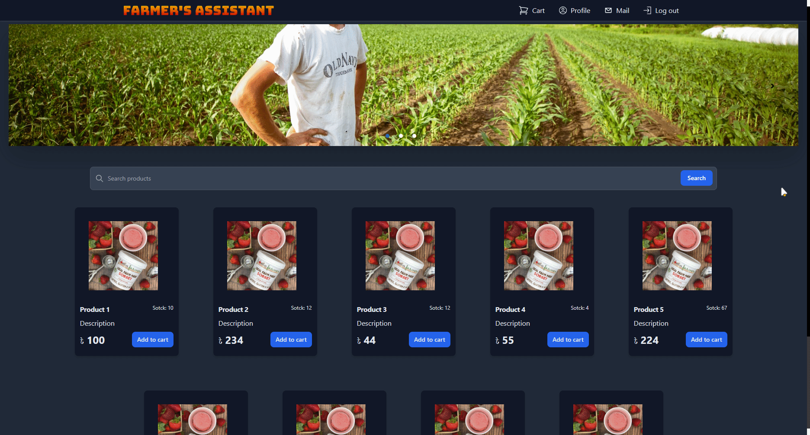
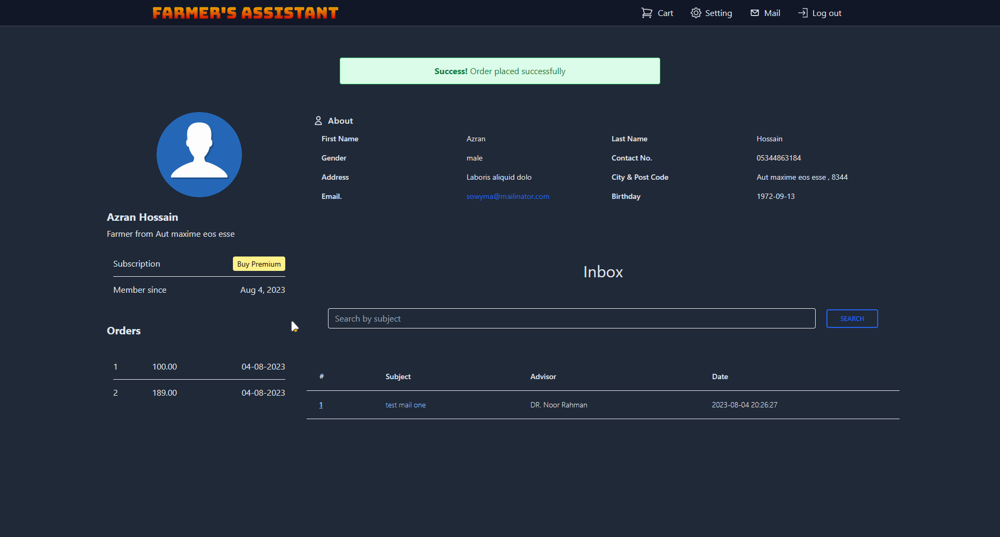
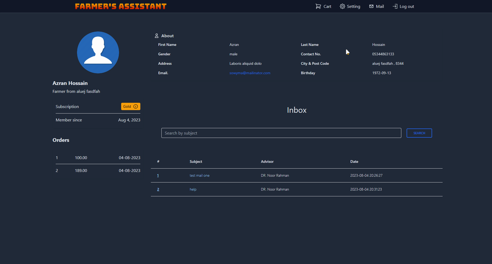

# Farmers Assistant Project

The Farmers Assistant project is a web application built using Laravel and Tailwind CSS. It provides a platform for farmers, admins, and advisors to interact and facilitate farming-related activities. Users can register, login, and perform specific actions based on their roles.

## Features

1. **User Roles**
   - Admin: Responsible for managing the application, including adding/removing advisors and setting subscription prices.
   - Farmer: Can register, login, and purchase agricultural products from the platform.
   - Advisor: Can register, login, and provide assistance to subscribed farmers via email.

2. **Registration and Login**
   - All users (Admin, Farmer, Advisor) can register and log in to access their respective functionalities.

3. **Product Purchase**
   - Farmers can browse and purchase various agricultural products available on the platform.

4. **Subscription System**
   - Farmers can choose to subscribe to the platform by paying a subscription fee.
   - Subscribing farmers get access to additional features, including assistance from advisors through email.
   - Admins can manage subscriptions, set subscription prices, and view subscribed farmers.

5. **Discounts**
   - Subscribed farmers receive discounts on agricultural products.

## Demo

Login as Farmer


order


Mail


profile edit



## Installation

To set up the Farmers Assistant project locally, follow these steps:

1. Clone the repository from GitHub.

```bash
git clone <repository-url>
```

2. Install the required dependencies using Composer.

```bash
composer install
```

3. Create a `.env` file from the `.env.example` file and update the database and other configuration settings as required.

4. Generate a new application key.

```bash
php artisan key:generate
```

5. Run the database migrations to set up the necessary database tables.

```bash
php artisan migrate
```

6. Seed the database (if required) with initial data such as admin credentials, advisor details, etc.

```bash
php artisan db:seed
```

7. Compile the frontend assets using pnpm (assuming Node.js is already installed).

```bash
pnpm install
pnpm  dev
```

8. Start the development server.

```bash
php artisan serve
```

9. Access the application in your browser by visiting the URL displayed in the terminal.
